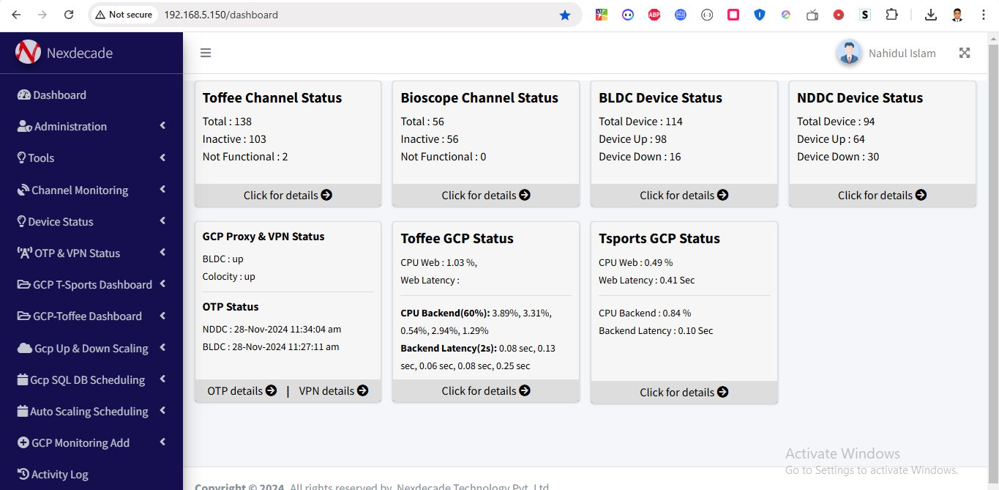
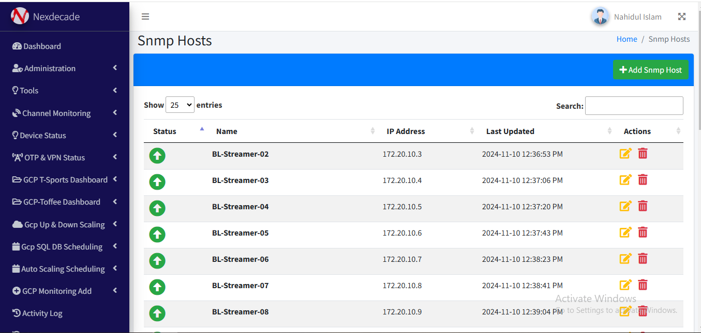
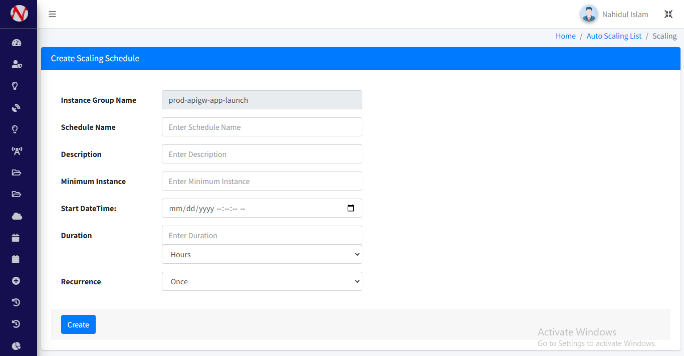

#  **System Monitoring and Alerting Dashboard**  

A comprehensive system monitoring solution leveraging Google Cloud Platform (GCP) APIs, Observium, and Laravel to provide real-time performance metrics, network diagnostics, and automated alerts through Slack and WhatsApp.

---

## 🌟 **Key Features**  

### 1. **GCP Monitoring Dashboard**  
- Developed dashboards using **Google Cloud APIs** to monitor critical metrics:  
  - **CPU Usage**  
  - **Memory Utilization**  
  - **Network Latency**  
- Integrated **Observium API** for advanced server health checks and real-time alerts.  

### 2. **Linear Channel Monitoring**  
- Built a linear channel monitoring tool that sends **Slack** and **WhatsApp notifications** if any channel goes down.  
- Integrated **GCP Autoscaling** to dynamically adjust resources.  
- Implemented **database scheduling** with **Laravel CronJobs** for efficient task automation.  

### 3. **Network Diagnostics Tools**  
- Created tools for:  
  - **Ping and Trace diagnostics**  
  - **OTP status checks**  
  - **Two-way SNMP monitoring** for servers, routers, and switches.  

---

## 🛠️ **Technologies Used**  
- **Google Cloud Platform (GCP)**  
- **Observium API**  
- **Slack/WhatsApp Integration**  
- **Laravel** (CronJobs for task scheduling)  
- **SNMP Protocols**  
- **Docker**  

---

## 📸 **Project Snapshots**  
Include snapshots here to visualize the key components of your dashboards and tools.  

    
    
    
     
        
    
     
        
    
     
        
    
     
        
    
     
        
    
     
        
    
        
    
     
        
    

